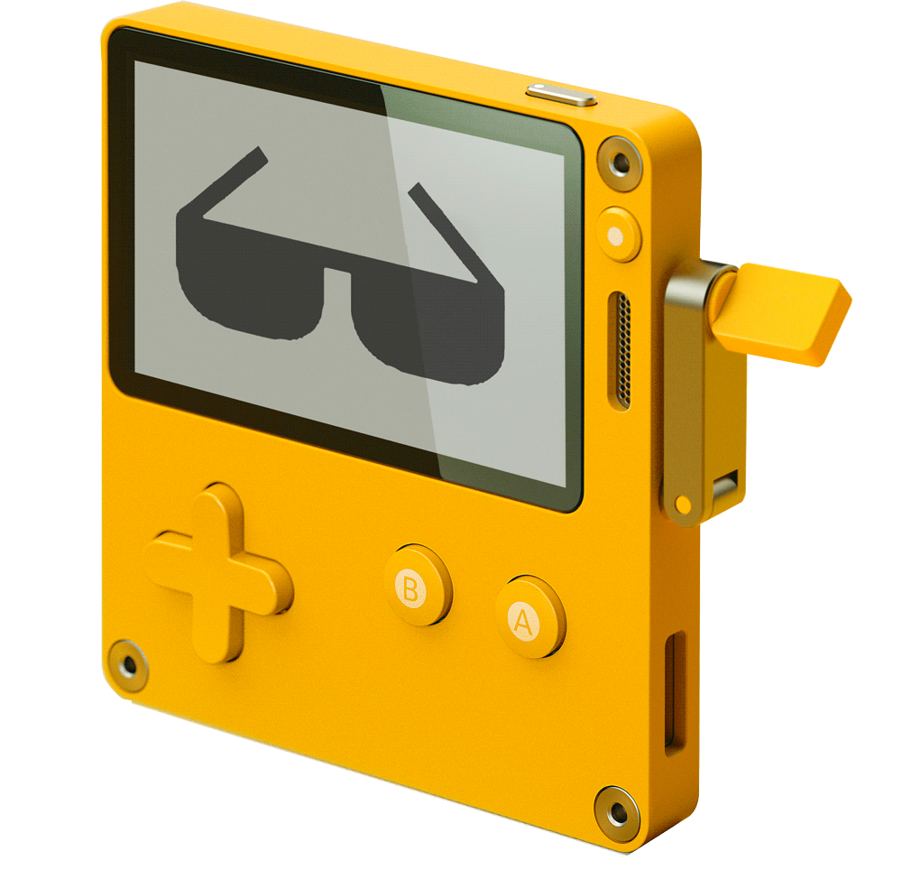

# Awesome Playdate   
A list of awesome resources for game development on Panic's Playdate console.

> ⚠️ &nbsp; The Playdate is unreleased; this information is preliminary and "best effort"
>
> ⚠️ &nbsp; Links may include spoilers

## Contents
- [Game Development](#game-development)
  - [Programming Frameworks & Languages](#programming-frameworks--languages)
  - [Development Concepts](#development-concepts)
  - [Graphics](#graphics)
- [Social](#social)
  - [Discussion groups](#discussion-groups)
  - [Accounts to follow](#accounts-to-follow)
- [Playdate Games & Dev Blogs](#playdate-games--dev-blogs)
- [Open Source Playdate Games & Example Code](#open-source-playdate-games--example-code)

## Game Development

### Programming Frameworks & Languages

#### Pulp + Pulpscript
A "no-code alternative to the full SDK", Pulp provides a "click-and-place" game editor right in your browser.

> ⚠️ &nbsp; Pulp and Pulpscript are not yet released to the public.

##### Articles on Pulp + Pulpscript
Pulp and Pulpscript are still in development. See below for what's known about these tools.

- [Panic unveils Pulp - Gamasutra](https://www.gamasutra.com/view/news/382905/Panic_unveils_Pulp_a_free_nocode_tool_for_creating_Playdate_games.php)
- [Playdate Pulp - playdate.wiki](https://playdate.wiki/development/playdate-plup)

#### Lua

##### Playdate SDK
Panic plans to publish two versions of their SDK: a high-level API for Lua, similar to LÖVE (see below), and a lower-level C library for applications with higher performance needs.

> ⚠️ &nbsp; The Playdate SDKs are not yet released to the public. Consider using LÖVE (see below) in the meantime; Panic has reported that LÖVE provides a similar API to the Playdate SDK.

###### Playdate SDK Previews
- [Playdate Programming LIVE](https://www.youtube.com/watch?v=MZRtfiD_308&t=2629s) - 50 minute long programming demo that shows some of the SDK and simulator.
- [Playdate Unboxing + Project Setup](https://www.youtube.com/watch?v=LiCJF4TfWno)
- [Early Playdate SDK release notes](https://twitter.com/playdate/status/1143268123098796033)

##### Lua Libraries
The following libraries are expected to work well-enough on the Playdate:

- [deep](https://github.com/Nikaoto/deep) - An "action-queue" library; helpful for things like z-indexing.
- [GFXP](https://github.com/ivansergeev/gfxp) - A library with a collection of dithering patterns for the Playdate. An online version of the editor can be seen [here](https://ivansergeev.com/gfxp/).
- [Knife](https://github.com/airstruck/knife) - A collection of useful micro-modules for Lua.
- [Jumper](https://github.com/Yonaba/Jumper) - A pure Lua pathfinding library for grid-based games.
- [lua-star](https://github.com/wesleywerner/lua-star) - A* pathfinding in pure Lua.
- [Noble Engine](https://github.com/NobleRobot/NobleEngine) - Noble Engine is a Lua-based game engine library built on top of the Playdate SDK that offers a variety of helpful features. [Docs here](https://noblerobot.github.io/NobleEngine/).
- [profile.lua](https://bitbucket.org/itraykov/profile.lua/src/master/) - Performance profiling for Lua applications.
- [tiny-ecs](https://github.com/bakpakin/tiny-ecs) - An entity component system in pure Lua.

##### LOVE
The Lua-based [LÖVE](https://love2d.org/) framework offers a similar API to the Playdate Lua SDK, useful for prototyping before the public release of the Playdate SDK.

See [love2d-community/awesome-love2d](https://github.com/love2d-community/awesome-love2d) for additional resources.

- [love-playdate-emulation](https://github.com/cadin/love-playdate-emulation) - A basic template for previewing games built with LÖVE in a Playdate-like environment.

#### C
> ⚠️ &nbsp; The Playdate SDKs are not yet released to the public. Consider using LÖVE (see above) in the meantime; Panic has reported that LÖVE provides a similar API to the Playdate SDK.

- [Taxman Engine](https://github.com/McDevon/taxman-engine) - A 2D, platform-independent game engine designed for the Playdate. Online demo [here](https://mcdevon.github.io/taxman-wasm/)

#### Experimental & Other
These projects represent experiments with the Playdate. Use at your own risk.

- [Crankstart](https://github.com/rtsuk/crankstart) - An experimental Rust crate to write games for the Playdate in Rust.
- [playdate-rs](https://github.com/igaryhe/playdate-rs) - Unofficial Rust binding for Playdate C API.
- [VSCode-PlaydateTemplate](https://github.com/Whitebrim/VSCode-PlaydateTemplate) - VSCode autocompletion with the Playdate simulator. Windows only.

### Development Concepts

#### Game Programming Patterns
- [Game Programming Patterns (book)](https://gameprogrammingpatterns.com/) - The Web version is free.

#### Graphics & Art
- [Ditherpunk](https://surma.dev/things/ditherpunk/) - An article about monochrome image dithering.
- [Stabilized dithering using sphere mapping](https://forums.tigsource.com/index.php?topic=40832.msg1363742#msg1363742) - A dithering implementation used in _Return of the Obra Dinn_.
- [Playdate Art: Scale](https://donaldhays.com/2019/12/30/playdate-art-scale/) - Important notes on designing sprites, fonts, and tiles for the Playdate.

#### Procedural Generation
- [Making Martian Faces](https://dukope.itch.io/mars-after-midnight/devlog/263965/making-martian-faces) - Notes about generating characters for _Mars after Midnight_.
- [Procedural Content Generation Wiki](http://pcg.wikidot.com/)

### Graphics
- [DrawDate](https://neil.today/drawdate/) - 1-bit, browser-based sprite editor. [GitHub Source](https://github.com/neil-morrison44/drawdate).

## Social

### Discussion groups
- [Official Playdate Discord](https://discord.com/invite/zFKagQ2)
- [/r/PlaydateConsole/](https://www.reddit.com/r/PlaydateConsole/) - A Playdate subreddit. Panic employees comment here occasionally.

### Accounts to follow

#### Official Playdate accounts
- [@panic](https://twitter.com/panic) - Official Panic Twitter.
- [@playdate](https://twitter.com/playdate/) - Official Playdate Twitter.
- [@playdateAlerts](https://twitter.com/playdateAlerts) - Official Playdate news.

#### Game Dev Accounts

##### Playdate & Panic
- [@shauninman](https://twitter.com/shauninman) - Playdate Developer & Designer at Panic. Developing [_Ratcheteer_](https://twitter.com/shauninman/status/1402298970848772099?lang=en).
- [/u/sardinebrunch](https://www.reddit.com/user/sardinebrunch) - Playdate Developer at Panic, contributes to /r/PlaydateConsole.

##### Third-party Devs
- [@Dovuro](https://twitter.com/Dovuro) - Misc. Jam games, including a version of Chess, and a port of Bubble Factory.
- [@dukope](https://twitter.com/dukope) - Developing _Mars after Midnight_ (see below).
- [@frankjonen](https://twitter.com/frankjonen) - Developing _Silverball Tactics_ (see below).
- [@gingerbeardman](https://twitter.com/gingerbeardman) - Developing _Daily Driver_ (see below).
- [@RNGParty](https://twitter.com/RNGParty) - Developing _Poly's Roly Rumble_ (see below).
- [@uvulaLLC](https://twitter.com/uvulaLLC) - Developing _Crankin's Time Travel Adventure_ (see below).
- [@veubeke](https://twitter.com/veubeke) - Developing _Down the Oubliette_.

## Playdate Games & Dev Blogs
- [Crankin's Time Travel Adventure (Official site)](https://uvula.jp/crankin)
  - [Demo Video](https://www.youtube.com/watch?v=rwxrfgCIZ-c)
  - [Demo Video 2](https://www.youtube.com/watch?v=C8rv8HeSAs8)
- [Daily Driver (Dev Blog)](https://blog.gingerbeardman.com/tag/dailydriver/)
  - [Patreon](https://www.patreon.com/dailydriver) 
- [Mars after Midnight (Devlog)](https://dukope.itch.io/mars-after-midnight)
- [Poly's Roly Rumble (Patreon)](https://www.patreon.com/rngparty)
  - Twitter (see above)
  - [Discord](http://discord.gg/BWW9YNF)
  - [YouTube Channel](https://www.youtube.com/channel/UC15JbSpnLmarkIVL3rQSxNg)
- [Silverball Tactics (Official site)](https://silverballtactics.com/)
  - [YouTube Channel](https://www.youtube.com/channel/UC7TGO4RB663chmDe7VlZL6Q)
  - [Instagram](https://www.instagram.com/silverballtactics/)
- [Widget Satchel II: Return of Sprocket (Official site)](https://noblerobot.com/widgetsatchel-ii)

## Open Source Playdate Games & Example Code
- [Game of Life](https://github.com/Whitebrim/Game-of-life-love2d-playdate) - An implementation of Conway's Game of Life meant to provide a template for games to be built in Love2d and ported to Playdate.
- [Klondike Solitaire for Playdate (GitHub Repo)](https://github.com/rtsuk/crankstart-klondike)
- [Oops You Started An Intergalactic War](https://monkeymad2.itch.io/oops-you-started-an-intergalactic-war)
  - [GitHub Repo](https://github.com/neil-morrison44/playdate_jam_etiquette)
- [Playdate Anticipation Jam Submissions (Unofficial. - Nov. 2020)](https://itch.io/jam/unofficial-playdate-jam/entries) - A first "pre-Playdate" 1-bit game jam that resulted in the following submissions.
- [Six Card Golf](https://github.com/CGagnier/six-card-golf) - A love2d card game meant to be ported to Playdate.

## Contributing
Contributions welcome! Read the [contribution guidelines](CONTRIBUTING.md)

## Footnotes

### Official Links
- [Official Playdate Site](https://play.date)
- [Playdate Developers Site](https://play.date/dev)
- [Playdate Store](https://shop.play.date/)
- [Panic Official Site](https://panic.com/)
- [Panic Podcasts](https://podcast.panic.com/)
- [Panic Blog](https://panic.com/blog/)
- [Teenage Engineering](https://teenage.engineering/)
- [Playdate Media Kit & FAQ](https://play.date/mediakit/)

### News, Background, and Fluff

#### Panic & TE Announcements
- [2021-07-29: Panic Podcast Episode 6: The Story of Playdate](https://bit.ly/2Vg3Hs5)
- [2021-06-08: Say Hello to Playdate! (Panic)](https://www.youtube.com/watch?v=HdF3CnFvxg4)
- [2021-06-08: Playdate Update - 6/8/2021 (Panic)](https://www.youtube.com/watch?v=DeWGukDrc1U)
- [2020-09-22: Make Games for Playdate (Panic)](https://www.youtube.com/watch?v=FH9HEmCwAvk)
- [2019-12-01: December 2019 Update](https://play.date/update-dec/)
- [2019-06-01: Small Wonder: Edge Magazine's Playdate Cover Story](https://imgur.com/a/CWMNBvI)
- [2019-05-31: "The Talk Show" - Interview with Cabel Sasser, Steven Frank, and Greg Maletic about Playdate](https://daringfireball.net/thetalkshow/2019/05/30/ep-252)
- [Teenage Engineering: Introducing Playdate](https://teenage.engineering/designs/playdate)

#### Misc. Articles of Note
- [Engadget: Playdate hands-on](https://www.youtube.com/watch?v=5ykEZ_iExGY) - One of the more in-depth previews of the platform.
